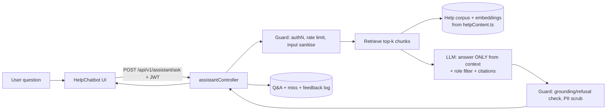

# Help Chatbot — Phase 2 (LLM/RAG) Guidance for Future Agents

**Audience:** the engineer/agent who picks up the chatbot after Phase 1.
**Status:** design guidance — do NOT start until the decision gate in §1 is met.
**Prereqs to read first:** `docs/help-chatbot-audit-redeployment-plan.md`, `frontend/src/components/helpContent.ts`, `AGENT_HANDBOOK.md`, `DEPLOYMENT.md`.

---

## 0. Where Phase 1 left things

The assistant is a deterministic, client-side keyword matcher. Its knowledge lives in one file — `frontend/src/components/helpContent.ts` (`knowledgeBase`, `mainMenu`, `adminMenu`, `findKnowledgeEntry`). It's accurate, zero-cost, zero-latency, and safe. Its only real limits: it can't paraphrase, can't handle questions worded far from the keywords, and can't use live account data.

**Phase 2 replaces the *matcher*, not the *content*.** `helpContent.ts` becomes (or seeds) the retrieval corpus. Keep it as the source of truth so answers stay grounded and reviewable.

---

## 1. Decision gate — don't build this reflexively

Only start Phase 2 if, after Phase 1 has been live a while, you have **evidence** it's needed:

- A log of real user questions that Phase 1 sent to the fallback (see §7 — add miss-logging first).
- That log shows a material rate of legitimate, varied phrasings the keyword matcher can't reach.

If the misses are just a few missing topics, the cheaper fix is to add entries to `helpContent.ts`. An LLM adds a backend, cost, latency, and an attack surface — justify it with data. **Recommendation: ship Phase 1, add miss-logging, revisit in a few weeks.**

---

## 2. Target architecture (RAG, retrieval-grounded)

Retrieval-Augmented Generation with strict grounding. The model may only answer from retrieved app-help context; otherwise it says it doesn't know and offers the menu. No open-domain answering.

Keep the current keyword matcher as a **fast path / fallback**: try `findKnowledgeEntry` first; only call the LLM when it returns null (saves cost and latency, and degrades gracefully if the LLM is down).

---

## 3. Build it on the existing stack (don't add infra you don't need)

- **Backend:** new `backend/src/controllers/assistantController.ts` + `assistantService.ts`, route `POST /assistant/ask` behind `authenticateToken` (never expose the model key to the browser).
- **Corpus:** generate chunks from `helpContent.ts` (one chunk per KB entry: `key`, `answer`, `keywords`, `adminOnly`). Add longer-form docs later if needed. Keep the generator in-repo so the corpus is rebuilt from the source of truth on deploy.
- **Vector store:** prefer **pgvector** on the existing Postgres (add an `embedding` column / `help_chunks` table via a Prisma migration) — no new datastore, stays inside your DB and backups. Only reach for a dedicated vector DB at much larger scale.
- **Models:** use whatever your org has approved. Keep the provider behind an interface (`assistantProvider.ts`) so it's swappable; put the key in the existing secrets mechanism (env/KMS per `AGENT_HANDBOOK.md`), never client-side. Pin model versions.
- **Embeddings:** embed the corpus at build/deploy time (small, static), cache them; embed the user query at request time.

---

## 4. Grounding & prompt design (the accuracy contract)

- System prompt: *"You are the Web Forx Time Tracker help assistant. Answer ONLY using the provided context. If the answer isn't in the context, say you don't know and suggest opening the menu. Never invent features, prices, or steps. Keep to the app's actual UI."*
- Inject only the retrieved chunks as context; include their `key` so the response can cite/deep-link.
- **Refusal path:** if retrieval confidence is low or the model can't ground the answer, return the deterministic fallback + menu (reuse Phase 1's fallback).
- Prefer extractive answers (quote/lightly rephrase the chunk) over free generation.

---

## 5. Security & privacy (this is the main reason to be careful)

- **AuthN/Z:** endpoint requires a valid JWT; derive role server-side. Filter `adminOnly` chunks out of retrieval for Employees (mirror Phase 1's `includeAdminOnly`). Never trust a client-supplied role.
- **Tenant isolation:** the help corpus is generic (safe), but if you ever add org-specific content, scope retrieval by `organization_id`.
- **Prompt injection:** treat the user message as untrusted. Never let it change the system instructions; don't let retrieved/user text trigger tools or external calls. No tool-calling in v1.
- **PII / data minimisation:** don't feed user account data into the prompt in v1 (it's a *help* bot, not an account agent). If you later add "answer from my data," gate each data source behind explicit authorization and log access.
- **Output safety:** scrub anything that looks like a secret; never echo tokens, internal IDs, or stack traces.
- **Rate limiting & abuse:** per-user rate limit (reuse `express-rate-limit`), max input length, and a monthly cost cap / circuit breaker.
- **Compliance:** log what's needed for audit without storing sensitive content; align retention with your SOC2/ISO posture. Document the data flow in `DEPLOYMENT.md`.

---

## 6. Reliability & cost

- **Fast path first** (keyword matcher) → LLM only on miss. Cache embeddings; consider caching answers for identical common questions.
- **Timeouts + fallback:** if the LLM call errors or exceeds a timeout, return the deterministic fallback so the widget never hangs.
- **Budget guardrails:** token caps per request, concurrency limit, and a kill-switch feature flag (`ASSISTANT_LLM_ENABLED`) to instantly revert to pure Phase-1 behavior.
- **Observability:** log latency, token usage, retrieval scores, refusal rate, and cost per day (SLO/SLI mindset per your ops standards).

---

## 7. Do this in Phase 1.5 regardless: miss-logging + feedback

Before (or alongside) the LLM, add a lightweight signal so you know what to improve:

- Log unmatched free-text questions (no PII beyond the question text; get sign-off) to a small endpoint or table.
- Add 👍/👎 on bot answers.
- This log is both the §1 decision evidence and the Phase 2 evaluation set.

---

## 8. Evaluation & rollout

- **Golden set:** turn the §9 canonical questions in the audit plan (plus real misses) into an automated eval: each must retrieve the right chunk and produce a grounded answer. Run in CI.
- **Regression:** keep the Phase 1 vitest tests; add eval tests for the endpoint (mock the provider).
- **Rollout:** feature-flag (`ASSISTANT_LLM_ENABLED`), canary to internal users first, watch refusal/latency/cost, then widen. Rollback = flip the flag (falls back to Phase 1).
- **Acceptance criteria:** ≥ target grounded-answer rate on the golden set; zero hallucinated features in eval; p95 latency and per-day cost under agreed caps; admin-only content never shown to Employees in tests.

---

## 9. Explicitly out of scope for v1 (park these)

- Tool-calling / actions ("start my timer", "approve this") — high blast radius, needs its own authz + confirmation design.
- Answering from the user's live data — separate, higher-risk project with per-source authorization.
- Multi-language — only if the product goes multi-language.

---

## 10. TL;DR checklist for the future agent

1. Confirm the §1 decision gate with real miss data.
2. Add miss-logging + 👍/👎 first (§7) if not already there.
3. Generate the corpus from `helpContent.ts`; store embeddings in pgvector (Prisma migration).
4. Add `POST /assistant/ask` behind JWT; provider behind an interface; key in secrets.
5. Keyword fast-path → LLM on miss → deterministic fallback on low confidence/error.
6. Enforce role filtering, prompt-injection defenses, rate limits, PII minimisation.
7. Feature-flag it; build the golden-set eval; canary; watch cost/latency/refusal.
8. Keep `helpContent.ts` as the single source of truth — update it when features ship.
