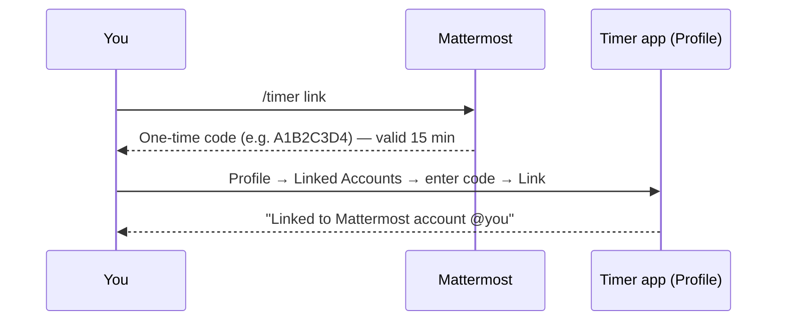

# Using the Timer from Mattermost

> **Who this is for:** Anyone who wants to start, stop, and log time in the Web Forx Time Tracker directly from Mattermost using the `/timer` slash command.
> **What you'll do:** Link your Mattermost account to your Timer profile once, then run `/timer …` commands in any channel.
> **Last reviewed:** 15 July 2026

---

## 1. What this gives you

Once linked, you can run the timer without opening the web app:

- `/timer start Fixing login bug` — start tracking immediately.
- `/timer stop` — stop and save the entry.
- `/timer status` — see what's running and for how long.
- `/timer log 45 Code review` — log time you already spent.

Everything you do from Mattermost shows up in the web app (Dashboard, Timeline, Timesheet) just like a timer you started in the browser. All bot replies are **ephemeral** — only you see them.

---

## 2. Before you start

You need:

1. **An active Timer account** — you must already be invited and able to sign in to the app. The bot never creates accounts.
2. **The bot enabled for your organization** — an admin must have configured the Mattermost integration (the `/timer` command and verification token). If `/timer help` returns *"Mattermost integration is not configured,"* ask your admin. See [Appendix A](#appendix-a-admin-setup) for the admin steps.

### Two ways your account gets recognized

The bot figures out which Timer account you are, in this order:

| Method | How it works | When it applies |
| --- | --- | --- |
| **Email auto-link** | Your Mattermost email is matched to your Timer account automatically. | Only if your admin configured a **bot token** *and* your Mattermost email is the same as your Timer email. Nothing for you to do. |
| **Manual link (code)** | You link once with a one-time code (steps below). | Always works. Use this if your emails differ, or if auto-link isn't set up. |

If auto-link already covers you, `/timer status` will just work. If it says your account isn't linked, do the manual link below.

---

## 3. Link your profile (one-time)



**Step 1 — Get your code in Mattermost.**
In any channel, run:

```
/timer link
```

The bot replies (only you see it):

> Your linking code is **A1B2C3D4**. In the Timer app go to Profile → Linked Accounts and enter this code within 15 minutes. The code can only be used once.

**Step 2 — Enter the code in the Timer app.**

1. Sign in to the app and open **Profile** (sidebar footer → your name, or `/profile`).
2. Find the **Linked Accounts — Mattermost** card.
3. Type the 8-character code (e.g. `A1B2C3D4` — it auto-uppercases).
4. Click **Link**.

On success the card shows **Linked** and confirms *"Linked to Mattermost account @yourname."*

> 📸 **Screenshot:** the **Profile → Linked Accounts — Mattermost** card with a code entered, before clicking **Link**.

**Notes on the code**
- Valid for **15 minutes**, then it expires — run `/timer link` again for a new one.
- **Single use** — once redeemed it can't be reused.
- Running `/timer link` again invalidates any earlier code you were issued.
- Code format is 8 hex characters (`0-9`, `A-F`), e.g. `A1B2C3D4`.

---

## 4. Command reference

| Command | What it does | Example |
| --- | --- | --- |
| `/timer start <description>` | Starts a timer right away. | `/timer start Writing onboarding docs` |
| `/timer start` | If your admin configured the **bot token**, opens an interactive **Start Timer** dialog with a task field and a project picker. Otherwise starts with a default description. | `/timer start` |
| `/timer stop` | Stops the running timer and saves a time entry. | `/timer stop` |
| `/timer status` | Shows the running timer and elapsed time. | `/timer status` |
| `/timer log <minutes> <description>` | Logs a manual entry for time already spent. | `/timer log 45 Client call` |
| `/timer link` | Gets a one-time code to link your account. | `/timer link` |
| `/timer unlink` | Removes your manual account link. | `/timer unlink` |
| `/timer help` | Lists all commands. | `/timer help` |

### What the bot replies

- **Start:** ✅ `Timer started: **Writing onboarding docs**`
- **Start when one's already running:** ⚠️ `Timer already running. Use /timer stop first.`
- **Stop:** ✅ `Timer stopped: **Writing onboarding docs** (1h 12m)`
- **Stop with nothing running:** ⚠️ `No active timer found.`
- **Status (running):** ⏱️ `**Writing onboarding docs** — running 0h 27m`
- **Status (idle):** ⏱️ `No active timer running.`
- **Log:** ✅ `Logged 45 minutes: **Client call**`
- **Log with bad input:** `Usage: /timer log <minutes> <description>`

---

## 5. How Mattermost entries behave in the app

- **One timer at a time.** You can't start a second timer while one is running — stop it first. This is the same single-active-timer rule as the web app, and they share state (a timer started in Mattermost can be stopped in the browser, and vice versa).
- **Billable by default.** Entries created from Mattermost are marked billable.
- **Where they land:**
  - `/timer start` → `/timer stop` creates a normal **timer** entry (noted "Stopped via Mattermost").
  - `/timer log …` creates a **manual** entry (noted "Logged via Mattermost"). Like any manual entry, it may require **manager approval** before it counts on your final timesheet.
- **The interactive dialog** (`/timer start` with no text, when the bot token is set) lets you type a task and pick from up to 20 active projects, then click **Start Timer**.

---

## 6. Unlinking

Run:

```
/timer unlink
```

- If you had a manual link, the bot replies: ✅ `Your manual account link was removed.`
- If your org uses **email auto-link** (bot token configured), commands may still resolve to your account via your email even after unlinking — the bot tells you this. To stop that entirely, ask your admin to remove you from the user map.

---

## 7. Troubleshooting

| Symptom | Meaning / fix |
| --- | --- |
| *"Your Mattermost account is not linked. Run `/timer link`…"* | You're not linked yet — do [Section 3](#3-link-your-profile-one-time). |
| *"Your Mattermost email is not registered in the Timer app…"* | Auto-link is on but your Mattermost email doesn't match a Timer account. Link manually with a code, or ask your admin to align emails. |
| *"Invalid or expired code…"* | The code timed out (15 min) or was already used. Run `/timer link` again for a fresh one. |
| *"Invalid code format. Codes are 8 characters, e.g. A1B2C3D4."* | You entered the wrong length/characters in Profile. Copy the exact code from the bot. |
| ⚠️ *"Token verification failed…"* | The Mattermost slash-command token doesn't match what's stored in the app. This is an **admin** fix in **Admin → Bot Integrations**. |
| *"Mattermost integration is not configured."* | The bot isn't set up for your org yet — contact your admin. |
| *"Timer already running. Use `/timer stop` first."* | You (or your browser) already have an active timer. Stop it, then start a new one. |

---

## Appendix A — Admin setup

*(For Admins/Managers who configure the integration. End users can skip this.)*

**1. Create the slash command in Mattermost** — Integrations → Slash Commands → Add Slash Command:

| Field | Value |
| --- | --- |
| Command Trigger Word | `timer` |
| Request URL | `https://<api-host>/api/v1/bots/mattermost/<orgSlug>` |
| Request Method | `POST` |
| Autocomplete hint | `start [description] | stop | status | log <mins> <desc> | link | help` |

`<orgSlug>` is shown in **Admin → Bot Integrations**. After saving, copy the **verification token** Mattermost displays.

**2. Configure the app** — **Admin → Bot Integrations → Mattermost**:

- **Token** *(required)* — the verification token from step 1.
- **Mattermost Server URL** *(optional)* — e.g. `https://mattermost.yourcompany.com`.
- **Bot Token** *(optional)* — a Mattermost bot account's token.
- **Incoming Webhook URL** *(optional)* — for pushing notifications into a channel.
- **User Map** *(optional)* — manual Mattermost-user → Timer-user overrides.

Setting **Bot Token + Server URL** unlocks two conveniences: **email auto-link** (no manual codes needed when emails match) and the **interactive `/timer start` dialog** (task field + project picker). To create the bot: Mattermost → Integrations → Bot Accounts → Add Bot Account, then add it to channels where you want ephemeral confirmations.

---

*This guide reflects the `/timer` bot as implemented in `backend/src/controllers/mattermostBotController.ts`. If commands change, update this doc and the command reference table.*
