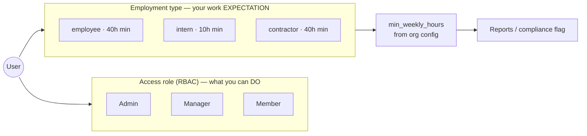

# RBAC + Worker Classification Redesign — Research & Plan

**Status:** Proposal (no code changed yet)
**Author:** DevSecOps review
**Date:** 2026-07-15
**Scope:** `backend/` (Prisma model, auth, user + report + ops services) and `frontend/` (Team, Admin, add/edit user)
**Constraint:** App is in production (119 active users, 1 admin). Changes must be backward-compatible and zero-downtime.

---

## 1. Recommended solution (start here)

**Root cause: the app conflates two independent concepts into a single `role` string.**

Today one field answers two unrelated questions:

- **What can this person *do*?** (access / permissions) → Admin, Manager
- **What is this person's *work expectation*?** (employment classification → weekly-hours target, billing, compliance) → Employee, Intern

Because there is only one field, elevating Helene Bayombi to **Manager** so she can approve PTO and run reports *also* silently reclassifies her work expectation to "staff / 40h", so she gets flagged non-compliant even though she met the 10h intern minimum.

**The fix is to split `role` into two orthogonal dimensions:**

| Dimension | Field | Answers | Values | Who sets it |
|---|---|---|---|---|
| **Access role (RBAC)** | `role` (existing) | What actions are allowed | `Admin`, `Manager`, `Member` | Admin only (Manager may create Members, never Admins) |
| **Employment type** | `employment_type` (**new**) | Work expectation / min hours / billing | `employee`, `intern`, `contractor` | Admin (and optionally Manager) |

Weekly-hours expectations come from **`employment_type`**, never from the access role. A person can be `role = Manager` + `employment_type = intern` — access of a manager, hours target of an intern. That is exactly Helene's case.

This is the standard enterprise pattern (NIST RBAC separates *roles/permissions* from *user attributes*; the hours target is an attribute-based rule on top of role-based access — effectively RBAC + a thin ABAC layer). It also cleanly delivers your three asks:

1. **Manager elevation no longer breaks compliance** — hours read from `employment_type`.
2. **Managers can create Member-tier users but never Admins** — enforced server-side, hidden in UI.
3. **`contractor` added** — as an employment type with a configurable 40h minimum (same as employee).

I recommend shipping this in **Phase 1 (additive, non-breaking)** below, and treating the optional access-role cleanup (collapsing `Employee`/`Intern` name-roles into a single `Member` access tier) as **Phase 2**, since renaming role strings on live data is the riskiest part and is not required to fix the bug.

---

## 2. Current-state findings (grounded in code)

| # | Finding | Evidence |
|---|---|---|
| F1 | RBAC is enforced by role **name string**, not a permission set. `Role.permissions` JSON exists but is seeded empty and unused. | `backend/src/middlewares/auth.ts` `requireRole(roles)` → `roles.includes(req.user.role)`; `backend/prisma/seed.ts` creates roles with no permissions |
| F2 | Seeded roles per org: `Admin, Manager, Employee, Intern`. | `backend/prisma/seed.ts:65` |
| F3 | A per-user `weekly_hour_limit Int?` already exists — but it is used as a **maximum / overload** signal, not a minimum target. | `backend/prisma/schema.prisma:72`; `opsInsightsService.ts:307` (`threshold = weekly_hour_limit * 2 : 100`); `timeEntryController.ts:301` (warn when *over* limit) |
| F4 | "Defaulter" today = **logged 0 hours** in the period — there is no per-role *minimum-hours* (e.g. "<40h") compliance check in the backend yet. | `reporterService.ts:190-200`; `executiveReportTemplate.ts:466` ("Defaulters (0h logged)") |
| F5 | **Security gap — privilege escalation.** `POST /users` (`createUser`) is open to `['Admin','Manager']` and has **no guard** preventing a Manager from assigning the `Admin` role. `resolveRoleId` resolves any role name. | `routes/userRoutes.ts` (`requireRole(['Admin','Manager'])`); `userController.ts:440-505` (no Admin check) |
| F6 | Inconsistent enforcement: **bulk import** *does* block non-admins creating Admins; **updateUser** restricts role changes to Admin; **single create** does not. | `userController.ts:632` (`actorRole !== 'Admin' && roleRecord.name === 'Admin'`), `:838` (`Only Admin users can change member roles`) |
| F7 | Frontend loads *all* roles (incl. Admin) from `/users/roles` and shows them in the add-user modal; inline role-change dropdown is `isAdmin`-gated but the create modal is not. So a Manager sees "Admin" when adding a user. | `frontend/src/pages/Team.tsx:145,913,904`; `getRoles` returns all org roles (`userController.ts:354`) |
| F8 | `weekly_hour_limit` is settable per-user via `updateUser` but is **not** in `createUserSchema`, so it can't be set at creation. | `validation/schemas.ts:68-78`; `userController.ts:1090` |

**Net:** the misclassification is architectural (F1–F4), and there is a real, separate privilege-escalation bug (F5–F7) that this work should close at the same time.

---

## 3. Target design

### 3.1 Two-dimension model



A user carries **one** access role **and** **one** employment type. They are independent.

### 3.2 Access-role permission matrix (make the implicit explicit)

| Capability | Admin | Manager | Member |
|---|:--:|:--:|:--:|
| Track own time / PTO request | ✅ | ✅ | ✅ |
| Create/import users (Member tier) | ✅ | ✅ | ❌ |
| Create/assign **Admin** | ✅ | ❌ | ❌ |
| Change a user's access role | ✅ | ❌ | ❌ |
| Change a user's employment type | ✅ | ✅ (config-gated) | ❌ |
| Approve PTO / timesheets, run team reports | ✅ | ✅ | ❌ |
| Org settings / billing / compliance mode | ✅ | ❌ | ❌ |

> Phase 1 keeps the current access-role names (`Admin/Manager/Employee/Intern`) working so nothing breaks; "Member" is the conceptual tier that `Employee`/`Intern`/`Contractor` map to for *access*. Phase 2 optionally collapses them.

### 3.3 Where min-hours lives

Store the map in **`Organization.settings`** (already a JSON blob used for `compliance_mode`), so it is org-configurable without a migration each time:

```jsonc
// Organization.settings
{
  "compliance_mode": "none",
  "employment_hours": {          // NEW
    "employee":   { "min_weekly_hours": 40 },
    "intern":     { "min_weekly_hours": 10 },
    "contractor": { "min_weekly_hours": 40 }
  }
}
```

Resolution order for a user's minimum target: **per-user override (`weekly_hour_limit` repurposed or a new `min_weekly_hours`) → org `employment_hours[type]` → hard default.** Keep `weekly_hour_limit` as the *max/overload* ceiling to avoid breaking `opsInsightsService`; introduce a separate minimum rather than overloading one field (recommended — avoids semantic collision noted in F3).

### 3.4 Schema change (additive, nullable)

```prisma
model User {
  // ...existing...
  employment_type   String?  @default("employee") // 'employee' | 'intern' | 'contractor'
  min_weekly_hours  Int?      // per-user override of org default (optional)
  @@index([organization_id, employment_type])
}
```

No column is dropped or renamed in Phase 1. `weekly_hour_limit` is untouched.

---

## 4. Phased implementation plan

### Phase 0 — Migration (expand), zero-downtime
- Add `employment_type` (nullable, default `'employee'`) and optional `min_weekly_hours` to `User` via a Prisma migration. Additive only.
- **Backfill** existing rows: `employment_type = 'intern'` where the user's role name is `Intern`, else `'employee'`. Contractors backfill to `'contractor'` if/when that role exists.
- Seed a **`Contractor`** access role per org (for Phase-1 compat) and the `employment_hours` block in every org's `settings`.
- **Acceptance:** migration applies on a staging clone of prod; backfill query shows 0 NULL `employment_type`; existing interns map to `intern`.

### Phase 1 — Backend authority (the real fix)
- **Compliance/report layer:** compute each user's minimum target from `employment_type` → org config → default. Replace/extend the "0h logged" defaulter rule with "logged < min_weekly_hours" *if* you want true under-hours flagging (confirm — see Open Decisions). Interns judged at 10h, contractors/employees at 40h.
- **RBAC guard (close F5–F6):** add one shared helper, e.g. `assertCanAssignRole(actorRole, targetRoleName)`, and call it in `createUser`, `importUsers`, **and** `updateUser` so the three paths are consistent. Rule: only `Admin` may create/assign the `Admin` role; `Manager` may assign Member-tier + employment types only.
- Add `employment_type` (+ optional `min_weekly_hours`) to `createUserSchema` and `updateUser`, with an allow-list validator.
- **Audit** every access-role and employment-type change to `AuditLog` (actor, target, before/after).
- **Acceptance:** a Manager JWT calling `POST /users` with `role=Admin` gets `403`; intern with 12h logged is compliant; contractor with 30h is flagged; unit tests cover the matrix in §3.2.

### Phase 2 — Frontend
- Split the single "Role" control in the Add/Edit user modal into **two** fields: **Access level** and **Employment type**.
- Filter the access-level options by the current user: Managers do **not** see `Admin` (fix F7) — but this is cosmetic; the server guard from Phase 1 is the real control.
- Add `Contractor` to employment-type options; show the resulting weekly minimum inline.
- **Acceptance:** logged in as Manager, "Admin" is absent from the create + inline dropdowns; creating an intern-Manager shows 10h target.

### Phase 3 — Admin config surface
- In `Admin.tsx` (there is already a `compliance` tab), add editing of `employment_hours` min-hours per type.
- **Acceptance:** changing intern min to 15h updates the flag threshold on next report.

### Phase 4 — Contract (optional, later)
- If desired, collapse access-role names `Employee`/`Intern`/`Contractor` → a single `Member` access role, migrating `requireRole` usages and JWT claims. Higher risk; do only after Phases 0–3 are stable.

---

## 5. Security considerations

- **Enforce on the server, always.** Hiding "Admin" in the dropdown (F7) is UX, not security. The authoritative control is the Phase-1 `assertCanAssignRole` guard on every write path. Assume the API is called directly.
- **Privilege escalation vectors to close:** Manager creates Admin (F5); Manager elevates self; Manager assigns Admin via bulk import (already blocked, keep parity); mass role change via `updateUser`.
- **Separation of duties:** access-role changes → Admin only; employment-type changes → Admin (and Manager if you choose), but never allow a Manager to grant access privileges via the employment field.
- **Least privilege / last-admin protection:** keep the existing "cannot remove the last Admin" and "cannot change own role" checks (`userController.ts:846,868`); extend them to the new guard.
- **Auditability (SOC2/ISO):** log actor, target, old/new access role, old/new employment type, timestamp, IP. Employment type affects pay/compliance, so treat it as an audited field.
- **Temporary elevation (future hardening):** Helene's case is a *temporary* grant. Consider time-boxed elevation (`role_expires_at` + a scheduled downgrade job) so elevations don't silently become permanent. Out of scope for the immediate fix; flagged for the roadmap.
- **Input validation:** allow-list `employment_type` and access-role values server-side; reject unknown strings (defense against arbitrary role injection through `role` free-string).

---

## 6. Operational checklist

- [ ] Snapshot / PITR checkpoint of the production DB before migration.
- [ ] Run migration + backfill on a **staging clone of prod** first; diff row counts.
- [ ] Backfill verification: `SELECT employment_type, count(*) FROM "User" GROUP BY 1;` — no NULLs, intern count matches expectation.
- [ ] Deploy backend **before** frontend (server tolerates missing `employment_type` from old clients via default).
- [ ] Feature-flag the new report/flag logic so the old "0h" behavior can be restored instantly.
- [ ] Re-run one historical report and confirm no new false-positive flags for interns.
- [ ] Audit-log sink verified for role/employment changes.
- [ ] Rollback plan: migration is additive → rollback = redeploy previous backend + turn off flag; no column drop needed.

---

## 7. Common failure modes + troubleshooting

| Failure mode | Symptom | Mitigation |
|---|---|---|
| Backfill misclassifies elevated interns | An intern already elevated to Manager backfills as `employee` (role != Intern) and keeps 40h target | Backfill from a known list / spot-check; allow Admin to correct employment type post-migration; Helene specifically must be set to `intern` |
| Old clients omit `employment_type` on create | New users default to `employee` unexpectedly | Server default `'employee'` + require the field once frontend ships; log creations missing the field |
| Report double-counts min-hours | Both `weekly_hour_limit` and new min used | Keep `weekly_hour_limit` = max only; min comes solely from employment resolution |
| Existing Manager-created Admins | Pre-fix escalations already in prod | One-time audit query: list Admins created by non-Admin actors from `AuditLog`; review with you |
| Empty role dropdown after filtering | Manager sees no options if filter is wrong | Filter must remove only `Admin`, keep Member tier + employment types; unit-test the filter |
| `requireRole` still gates on names in Phase 2 | 403s after collapsing role names | Do Phase 4 behind its own migration with JWT-claim compatibility window |

---

## 8. Open decisions (need your call)

1. **Under-hours flagging:** Do you want the report to actively flag "logged **less than** the minimum" (new behavior), or keep "0h logged" as the defaulter rule and just make the *displayed target* correct per type? (Recommend: add under-hours flagging, since that's the analysis you described.)
2. **Min-hours source of truth:** org-configurable map in `settings` (recommended) vs. hard-coded constants.
3. **Who edits employment type:** Admin only, or Admin + Manager?
4. **Existing prod users:** okay to auto-backfill (`Intern`→`intern`, else `employee`) and hand you a correction list, or do you want to review classifications first?
5. **Phase 4 (collapse access-role names):** do now or defer? (Recommend defer — not needed to fix the bug, and it's the riskiest change.)

---

*No code has been modified. On your go-ahead (and answers to §8), I'll implement Phase 0–2 with tests, on a branch, migration-first.*
